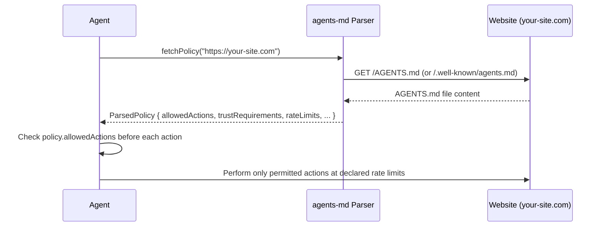
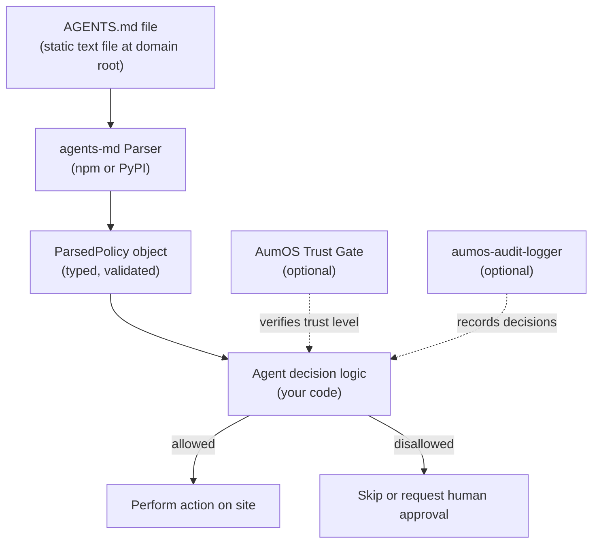

<!-- SPDX-License-Identifier: CC-BY-SA-4.0 -->
<!-- Copyright (c) 2026 MuVeraAI Corporation -->

# AGENTS.md Specification

**AGENTS.md** is a machine-readable file that website operators place at the root of their web property to declare their interaction policies for AI agents. Think of it as `robots.txt` — but designed for autonomous AI agents that perform actions, not just crawl content.

[](spec/AGENTS-MD-SPEC-001.md)
[](https://www.npmjs.com/package/agents-md)
[](https://pypi.org/project/agents-md/)
[](parsers/LICENSE)
[](spec/LICENSE)
[](https://github.com/aumos-ai/agents-md-spec)

---

## Why Does This Exist?

The web has had `robots.txt` since 1994. It is a plain text file sitting at the root of every major website, and search engine crawlers read it before deciding what to index. No crawler ignores it. No site owner needs to write code to enforce it. It just works — because it is a shared convention that every participant in the ecosystem has agreed to respect.

AI agents are different from crawlers in one critical way: they do not just read, they act. An AI agent shopping on your behalf can submit forms, make purchases, change account settings, and delete data. A crawling bot reading your pricing page is annoying if it ignores `robots.txt`. An AI agent making unauthorized purchases on your platform is a legal and financial emergency.

There is currently no standard way for a website operator to tell an AI agent what it is allowed to do. Each agent framework has its own conventions, each platform has its own API policies, and the gap between "what the operator intends" and "what the agent does" grows wider every day. AGENTS.md fills this gap with a file format so simple that any developer can write one in five minutes — and any agent can read it with a library call.

**What happens without AGENTS.md?** Agents operate on implicit assumptions. They guess what is permitted based on what is technically possible. Operators have no mechanism to communicate intent, set rate limits, require authentication, or mark paths as off-limits. The result is unpredictable agent behavior, operator friction, and an ecosystem where every platform must build ad-hoc controls from scratch.

AGENTS.md is the "robots.txt for AI agents" — the missing convention that lets operators and agents agree on the rules of engagement before anything happens.

---

## Who Is This For?

| Audience | Use Case |
|---|---|
| **Developers** | Parse AGENTS.md in your agent or framework to respect operator intent. Use the npm or PyPI library. |
| **Website Operators** | Place an `AGENTS.md` file at your domain root to declare your AI agent policy. No code required. |
| **Enterprise** | Enforce agent governance across your platform surface. Require specific trust levels, authentication, and rate limits. |
| **Standard Bodies** | Build on or reference this specification. CC BY-SA 4.0 allows derivative works with attribution. |

---

## What is AGENTS.md?

When an AI agent visits a website, there is currently no standard way for the site operator to communicate:

- Which actions the agent is allowed to perform
- What level of authentication or identity is required
- Rate limiting expectations
- Data handling commitments
- Which paths are off-limits

AGENTS.md fills this gap. An operator places the file at `https://example.com/AGENTS.md` (or `https://example.com/.well-known/agents.md`) and agents read it before interacting with the site.

### Why not `robots.txt`?

`robots.txt` addresses crawling only. It has no concept of actions, authentication, trust levels, or data policies. AGENTS.md complements `robots.txt` — they coexist and address different concerns.

### Why not `llms.txt`?

`llms.txt` is designed for passive LLM content consumption. AGENTS.md is designed for interactive agents that take actions on behalf of users.

---

## Quick Start

### For Website Operators (no code required)

**Prerequisites:** A web server that can serve static files.

Create a file named `AGENTS.md` and place it at the root of your domain so it is reachable at `https://your-site.com/AGENTS.md`.

**Step 1 — Minimal valid file (2 minutes):**

```markdown
# AGENTS.md

## Identity
- site: your-site.com
- contact: ai-policy@your-site.com
- last-updated: 2026-02-26
```

That is a complete, valid `AGENTS.md`. Agents reading it will apply permissive defaults for all omitted sections. You are done.

**Expected result:** Compliant AI agents will fetch this file before interacting with your site and respect the declared defaults.

**What just happened?** You published a machine-readable policy declaration. Any agent using the `agents-md` library will automatically discover this file at the well-known URL, parse it, and use the declared identity and defaults to govern its behavior on your site.

---

### For Developers (add parser to your agent)

**Prerequisites:** Node.js 18+ or Python 3.10+.

**TypeScript / JavaScript:**

```bash
npm install agents-md
```

```typescript
import { fetchPolicy } from 'agents-md';

// Fetch and parse before your agent takes any action
const result = await fetchPolicy('https://example.com');
if (result?.success && result.policy) {
  const policy = result.policy;
  console.log('Site:', policy.identity.site);
  console.log('Purchase allowed:', policy.allowedActions?.makePurchases);
  // false — respect this before acting
}
```

**Expected output:**
```
Site: example.com
Purchase allowed: false
```

**What just happened?** Your agent fetched `https://example.com/AGENTS.md`, parsed it into a typed policy object, and can now gate its actions against the operator's declared intent — before touching anything on the site.

**Python:**

```bash
pip install "agents-md[fetcher]"
```

```python
import asyncio
from agents_md import fetch_policy

async def main() -> None:
    result = await fetch_policy("https://example.com")
    if result and result.success and result.policy:
        policy = result.policy
        print(f"Site: {policy.identity.site}")
        print(f"Delete data allowed: {policy.allowed_actions.delete_data}")

asyncio.run(main())
```

---

## Minimal Example

Place this file at `https://your-site.com/AGENTS.md`:

```markdown
# AGENTS.md

## Identity
- site: your-site.com
- contact: ai-policy@your-site.com
- last-updated: 2026-02-26
```

That is a valid AGENTS.md. Agents will apply permissive defaults for all omitted sections.

## Full Example

```markdown
# AGENTS.md

## Identity
- site: app.example.com
- contact: ai-policy@example.com
- last-updated: 2026-02-26
- spec-version: 1.0.0

## Trust Requirements
- minimum-trust-level: 2
- authentication: required
- authentication-methods: oauth2, api-key

## Allowed Actions
- read-content: true
- submit-forms: true
- make-purchases: false
- modify-account: false
- access-api: true
- delete-data: false
- create-content: true

## Rate Limits
- requests-per-minute: 60
- requests-per-hour: 1000
- concurrent-sessions: 5

## Data Handling
- personal-data-collection: minimal
- data-retention: session-only
- third-party-sharing: none
- gdpr-compliance: true

## Restrictions
- disallowed-paths: /admin/*, /internal/*
- require-human-approval: /checkout/*, /account/delete
- read-only-paths: /blog/*, /docs/*

## Agent Identification
- require-agent-header: true
- agent-header-name: X-Agent-Identity
- require-disclosure: false
```

More examples are in [`spec/examples/`](spec/examples/).

---

## Trust Levels

AGENTS.md uses a generic 0–5 numeric scale:

| Level | Name | Description |
|---|---|---|
| 0 | Anonymous | No identity verification required |
| 1 | Identified | Agent has declared an identity but it is not verified |
| 2 | Verified | Agent identity has been verified (e.g., API key on file) |
| 3 | Authorized | Agent explicitly authorized by a human administrator |
| 4 | Privileged | Agent has elevated permissions (site-managed service account) |
| 5 | Administrative | Full administrative access |

---

## Parsers

Reference parsers are provided in two languages. Both are MIT licensed.

### TypeScript / JavaScript

```bash
npm install agents-md
```

```typescript
import { AgentsMdParser, fetchPolicy, validate } from 'agents-md';

// Parse from a string
const parser = new AgentsMdParser();
const result = parser.parse(fileContent);
if (result.success && result.policy) {
  console.log(result.policy.identity.site);
}

// Fetch directly from a URL
const fetched = await fetchPolicy('https://example.com');
if (fetched?.success && fetched.policy) {
  const validation = validate(fetched.policy);
  console.log(validation.valid);
}
```

See [`parsers/typescript/`](parsers/typescript/) for full documentation.

### Python

```bash
pip install agents-md
# For async fetching:
pip install "agents-md[fetcher]"
```

```python
from agents_md import AgentsMdParser, validate

# Parse from a string
parser = AgentsMdParser()
result = parser.parse(file_content)
if result.success and result.policy:
    validation = validate(result.policy)
    print(validation.valid)

# Fetch asynchronously (requires aiohttp)
import asyncio
from agents_md import fetch_policy

async def main():
    result = await fetch_policy("https://example.com")
    if result and result.success and result.policy:
        print(result.policy.identity.site)

asyncio.run(main())
```

See [`parsers/python/`](parsers/python/) for full documentation.

---

## Specification

The full specification is at [`spec/AGENTS-MD-SPEC-001.md`](spec/AGENTS-MD-SPEC-001.md).

Key topics covered:

- File location and discovery algorithm
- Complete section reference (Identity, Trust Requirements, Allowed Actions, Rate Limits, Data Handling, Restrictions, Agent Identification)
- Parsing rules for boolean, integer, and array values
- Trust level definitions (0–5 generic scale)
- Path pattern syntax (glob)
- Caching rules (24-hour maximum)
- Security requirements (HTTPS mandatory)
- Agent compliance recommendations
- ABNF grammar

The JSON Schema for programmatic validation is at [`spec/agents.schema.json`](spec/agents.schema.json).

---

## Repository Structure

```
agents-md-spec/
├── spec/
│   ├── AGENTS-MD-SPEC-001.md    # The specification
│   ├── agents.schema.json        # JSON Schema
│   ├── LICENSE                   # CC BY-SA 4.0
│   └── examples/
│       ├── minimal.agents.md
│       ├── blog.agents.md
│       ├── e-commerce.agents.md
│       ├── healthcare.agents.md
│       ├── government.agents.md
│       └── enterprise-saas.agents.md
├── parsers/
│   ├── LICENSE                   # MIT
│   ├── typescript/               # npm: agents-md
│   └── python/                   # PyPI: agents-md
├── docs/
├── README.md
├── CONTRIBUTING.md
├── CHANGELOG.md
├── CLAUDE.md
├── FIRE_LINE.md
└── LICENSE
```

---

## Architecture Overview

How `AGENTS.md` fits into the broader agent interaction lifecycle:





The core file format and parsers have zero dependencies on AumOS or any other platform. The optional integrations (dashed lines) are provided by separate AumOS packages if you want enforcement and audit trails beyond parsing.

---

## Related Projects

| Project | Description |
|---|---|
| [`aumos-core`](https://github.com/aumos-ai/aumos-core) | Core AumOS governance SDK — enforce AGENTS.md policies at runtime |
| [`mcp-server-trust-gate`](https://github.com/aumos-ai/mcp-server-trust-gate) | MCP server that checks trust levels before executing tool calls |
| [`agent-canary-tokens`](https://github.com/aumos-ai/agent-canary-tokens) | Honeypot tokens to detect unauthorized agent access |
| [`aumos-audit-logger`](https://github.com/aumos-ai/aumos-core) | Structured audit logging for agent actions and policy decisions |

---

## Contributing

See [CONTRIBUTING.md](CONTRIBUTING.md) for how to propose changes to the specification or submit parser improvements.

---

## License

- **Specification** (`spec/`): [CC BY-SA 4.0](spec/LICENSE) — share and adapt with attribution, under the same license.
- **Parsers** (`parsers/`): [MIT](parsers/LICENSE) — maximum adoption, minimal restriction.
- **This README and repo-level files**: CC BY-SA 4.0.

Copyright (c) 2026 MuVeraAI Corporation.
